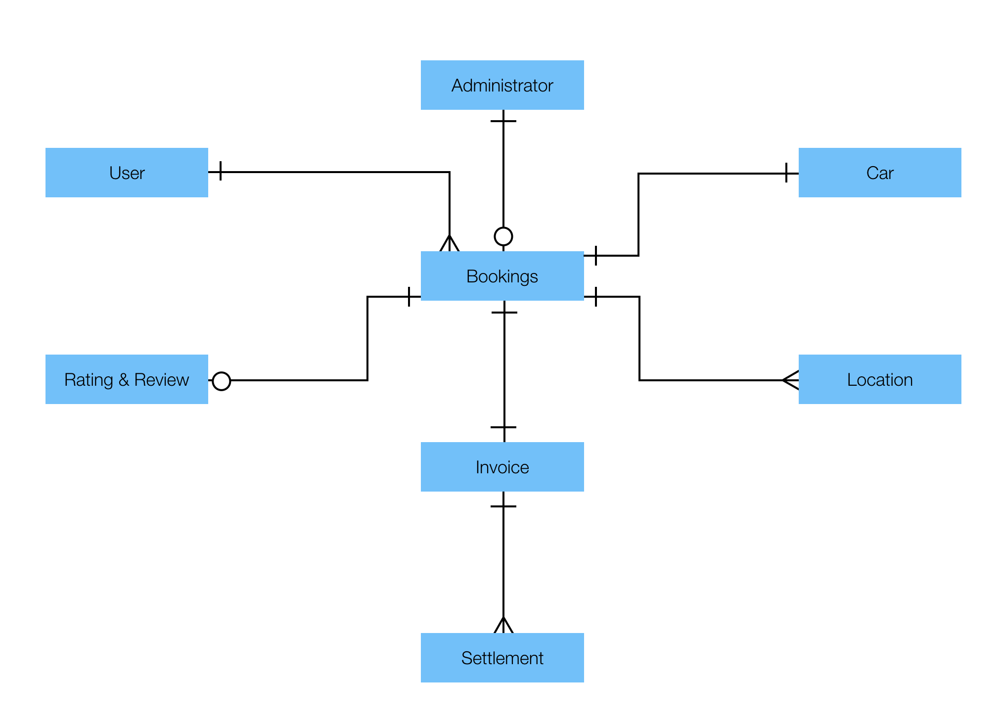

# Entity Relationship Diagram

## Overview / Assumptions

---

### 📅 Booking

    🔹 It's created by an User.
    🔹 It needs to be approved by an Administrator.
    🔹 It has 1 Car.
    🔹 It has Origin and Destination Locations.
    🔹 It has 0 or 1 Rating + Review.
    🔹 It has 1 Invoice.

---

### 👁 Administrator

    🔹 Approves 0 or more Bookings.

---

### 👤 User

    🔹 Has 1 or more Bookings.

---

### 🚗 Car

    🔹 Has a Location history.
    🔹 Has been used in 0 or more Bookings.

---

### 📍 Location

    🔹 Each Car has a Location (current), as part of its Location history.
    🔹 Each Booking has 2 Locations (Origin and Destination).

---

### ⭐ Rating + Review

    🔹 Rating can be 1 to 5 stars (worst to best).
    🔹 An optional Review can be attached to this Rating.

---

### 📄 Invoice

    🔹 It's related to 1 Booking
    🔹 It has 1 or more Settlements

---

### 💶 Settlement

    🔹 It's related to 1 Invoice
