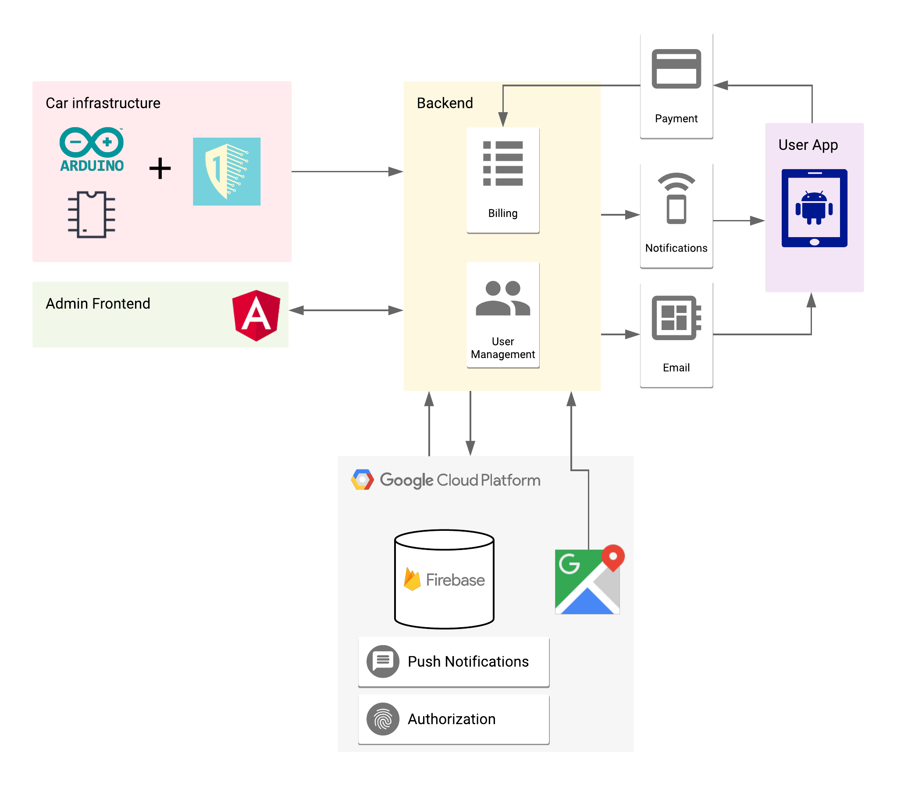

# System Infrastructure

## Mobile Application

Angular 6 will be used for the front-end application. This project will be started with the Angular CLI which already comes with Typescript, Karma, Jasmine, TSLint, etc...

## Front End Admin Panel

Android Studio will be used for the mobile app. This means that the Android SDK and all the tooling that comes with Studio (Gradle, Java libraries, JUnit, Google APIs, etc...) will be used for the app.

## Arduino Sensor System for fleet

Arduino code will be done using C/C++ language. The extension for the OneSheeld interface will be done in Java or as a standalone separate android service.

## Backend

Backend will be built in Firebase for data storage and authentication.

## Additional Services

- Plivo will be used for SMS transfer and reception.
- Firebase will be used for authentication.
- Stripe will be used for payment support.
- Google Maps will be our maps API.
