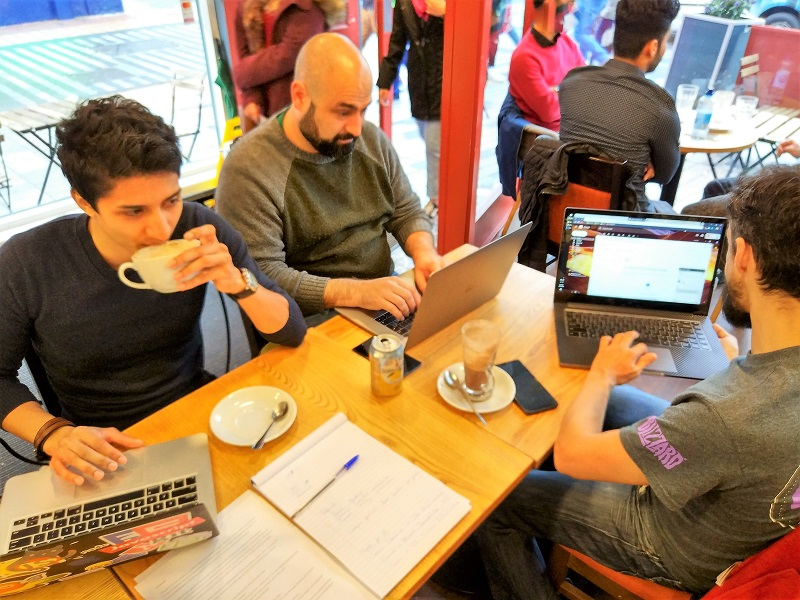

Attendees: **Dominic, Jesus, Isaac, Manuel**

We go over the requirements of the project and deliverables for the first milestone of the project.

## Project Structure
We agree that the project will have 4 distinct parts:
* Frontend that would be used by the admin user. This will be built with the Node stack. Frameworks not yet discussed.
* Mobile App that would be used by the customer user. This will be built for Android, using Android Studio and relevant technologies
* Arduino that would be plugged into the vehicle and transmit geolocation. 
* Backend servers for data transfer and storage. **Isaac** will investigate which technologies will be best to use.
* **Unique Feature**: Per project requirements, the unique feature for our app would be a _shared live location_ with friends, so they know when you're arriving or in which part of the journey you currently are.

## Development Environment
We discuss on the development environment we will use:
* **Deploy**: Heroku seems an acceptable hosting environment for the frontend app and part of the backend
* **Communicate**: Slack and CIT Gmail will be used for communication purposes
* **Code and Documentation**: We will use Github for code and documentation repositories
* **Shared email account**: We will use this email account with shared credentials to create the accounts we need in the different environments (Heroku, payments API, maps API, etc...)
* **Test**: Test environment has not been discussed in detail. We assume each technology will have its own testing framework (i.e. JUnit for Android, Mocha/Jasmine for Frontend, etc...)

## Ninja points
We discussed if there were any preferences in terms of parts of the project where anyone would like exposure or are more confident on what they're doing. The following list was compiled:
* Dominic: Frontend, presentations
* Jesus: No preference
* Isaac: Backend
* Manuel: Testing/QA, presentation

# Tasks for Week 2
For next week the following tasks have been agreed on:
- [ ] User Stories, mockups -> Jesus, Dominic
- [ ] Documentation -> Manuel
- [ ] Investigate SMS infrastructure -> Manuel
- [ ] Investigate DB and Firebase Authentication -> Isaac

Next meeting will take in place on Thursday, 11/10/2018
Meeting is adjourned

