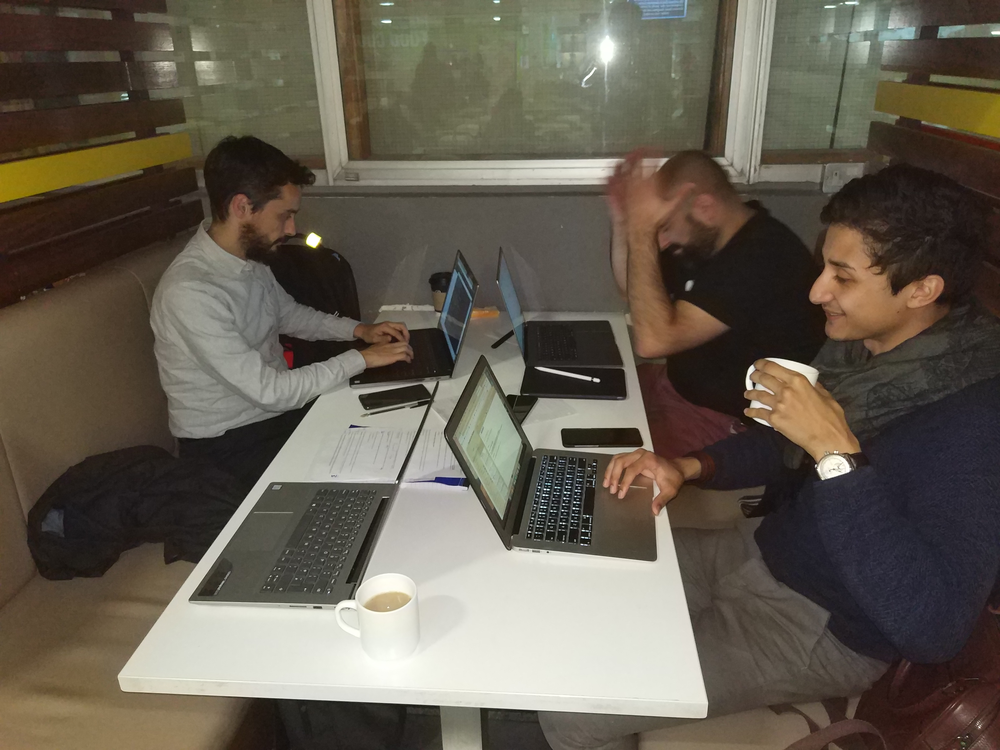

Attendees: **Dominic, Isaac, Jesus, Manuel**

# Meeting Agenda
## Project Status
- User Stories, mockups -> Jesus, Dominic
<video width="320" height="240" controls>
  <source src="../assets/video/login-flow.mp4" type="video/mp4">
</video>

- Documentation -> Manuel
- [Investigate SMS Infrastructure](https://github.com/jelitter/jauc/wiki/SMS-APIs-overview) -> Manuel
- Investigate DB and Firebase Authentication -> Isaac

## Points to Discuss
- [X] SMS provider to pick - Plivo
- [X] Create a new project in GitHub for documentation? -- Docs folder

### Questions for Seamus
* Admin panel > Register/profile/status need to be approved by the administrator. Are we talking about user registration? Car registration? Other admins? It refers to schedule, so we're not sure
* How the Arduino workflow works. Do we need to use SMS send at this point?
* Do we pay in advance or do we pay after the ride? If after, does that means that there may be an unsettled invoice? 

### Ninja Points
Entity ERD diagram. We discussed how these would be implemented and created first mockup.

# Tasks for Week 3
For next week the following tasks have been agreed on:
- [ ] Merge documentation into docs folder - Manuel
- [ ] Mockups and wireframes - Dominic
- [ ] User Stories - Jesus and Manuel
- [ ] Define ERD entities - Isaac

