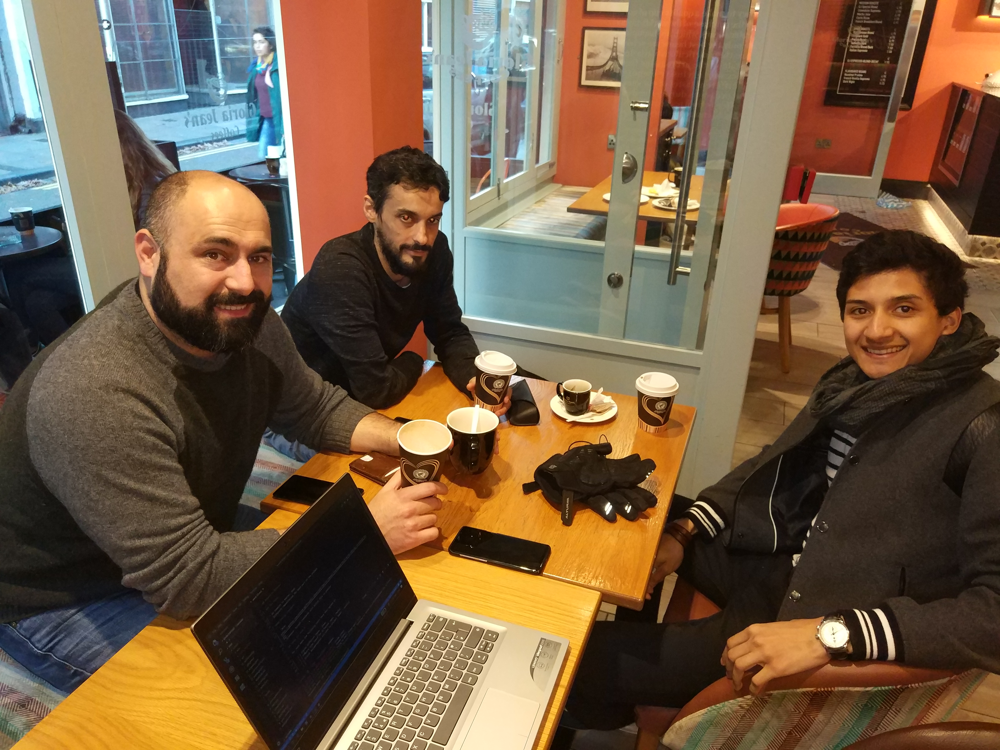

# Week 3 Meeting

Attendees: **Dominic, Jesus, Isaac, Manuel**

## Meeting Agenda

### Project Status

- [X] Merge documentation into docs folder - Manuel
- [X] Mockups and wireframes - Dominic
- [X] User Stories - Jesus and Manuel
- [X] Define ERD entities - Isaac

## Points to Discuss

### The rules

- No commits to master, EVER
- Different repositories for each part of the project

#### Coding standards

- Java: [Google Style Guide](https://github.com/autyzm-pg/friendly-plans/wiki/How-to-install-the-Google-Style-Guide-settings-in-Android-Studio)
- Frontend: Airbnb standards using ESLint with Prettier

## Tasks for Week 4

For next week the following tasks have been agreed on:

- [X] Create different repos - Isaac
- [X] Prepare Zube board for different repos - Manuel
- [X] Finish documentation and send to project leader - Dominic
- [X] Create Sequence Diagrams - Jesus

