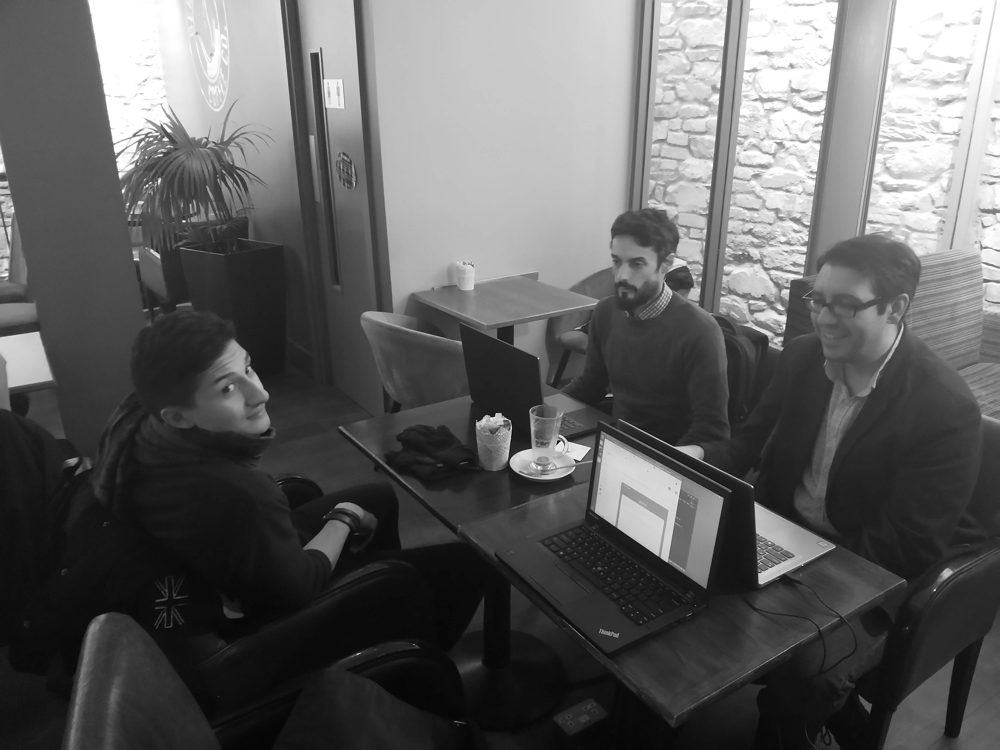

# Week 06 Meeting

Attendees:

- **Manuel**
- **Isaac**
- **Jesus**
- **Dominic**

## Meeting Agenda
Discuss general status of the project; challenges and successes. Next Steps.

### Project Status

- [X] Create different repos - Isaac
- [X]Prepare Zube board for different repos - Manuel
- [X]Finish documentation and send to project leader - Dominic
- [X]Create Sequence Diagrams - Jesus

## Points to Discuss
- How to avoid duplicate work; at the beginning of the week, grab a backlog card and stick to it
- Manuel will start working in the booking interface and map
- Jesus will finish the sequence Diagram, work on Arduino and start email registration for the mobile app
- Dominic and Isaac working on frontend and backend

## Tasks for Week 06 + 1
For next week the following tasks have been agreed on:

- [ ] Jesus - Sign with Email (App)
- [ ] Isaac - Finish structure for admin page, merging of multiple accounts
- [ ] Dominic - Cleaning up
- [ ] Manuel - Maps implementation for booking

