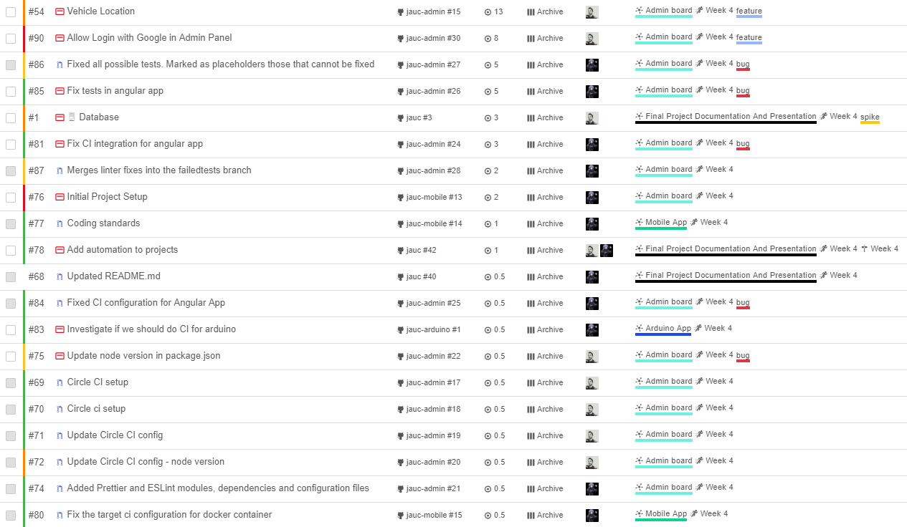
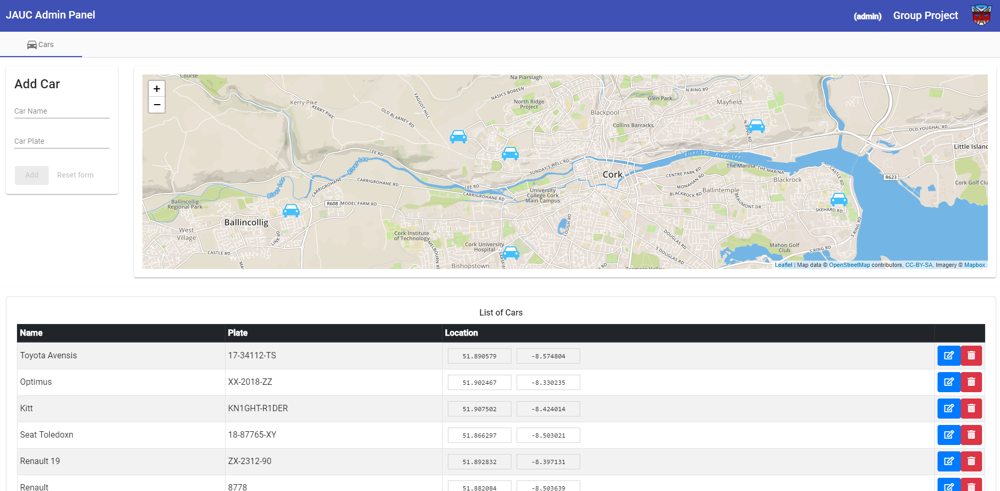
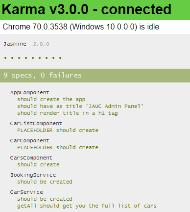

# Week 4

- Sprint deliverables (viable working product) as agreed in sprint back log

  - Application is able to display car location
  - Application is able to login users and create accounts using Google
  - Arduino board is able to track and send coordinates to the backend

- Any sprint documentation (sprintbacklog, user stories, designs, test etc.)

  During week 4 we worked on 20 issues worth 48 story points. 4 issues had to be moved into Week 5 sprint due to its complexity and lack of time to resolve.

  **Burndown chart**
  

  **Sprint Backlog**
  

  **Working Admin Dashboard showing car location**
  

  **Test suite running with initial basic tests**
  

  **Login option implemented**
  

  **Google login implemented**
  

  **Continuous integration implemented**
  

  **Coordinates from Arduino board being stored in backend database**
  

  
  
  

- Sprint retrospective/review documentation.

  - Testing is proving to be complicated, as the team is not experienced enough and some of the modules are not built in a way to be testable. Some time has been spent in figuring out best practices to do this.
  - Continuous integration has been set up and is already catching some linting and styling errors.
