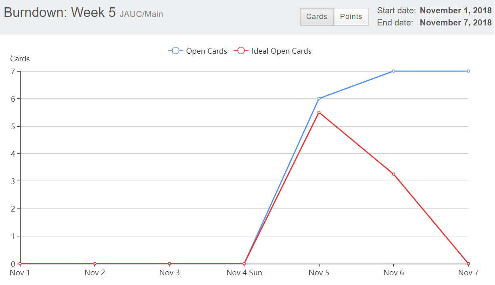
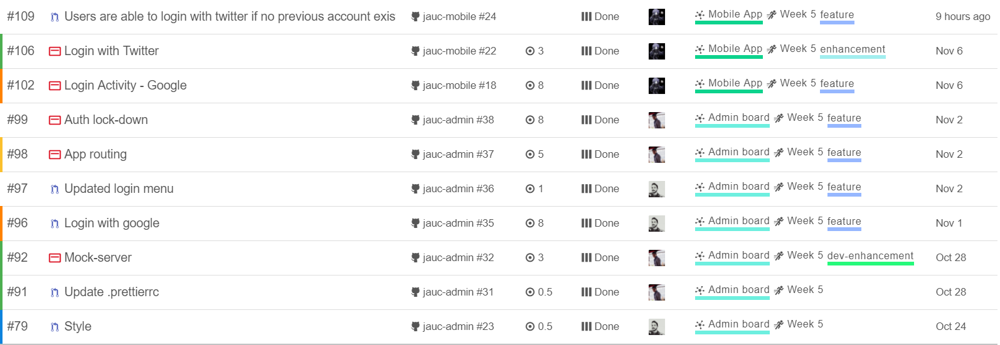
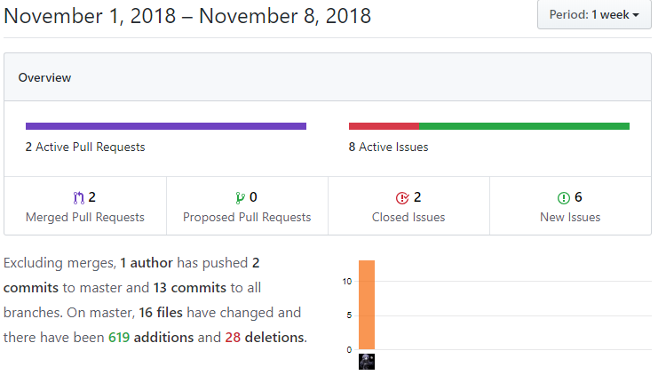
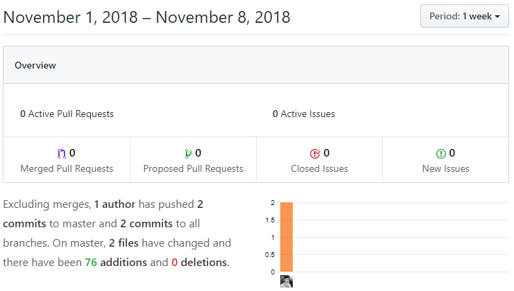
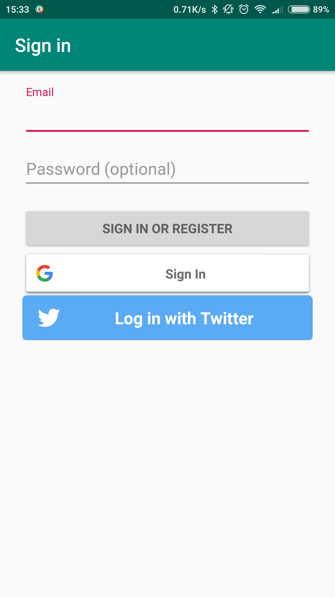
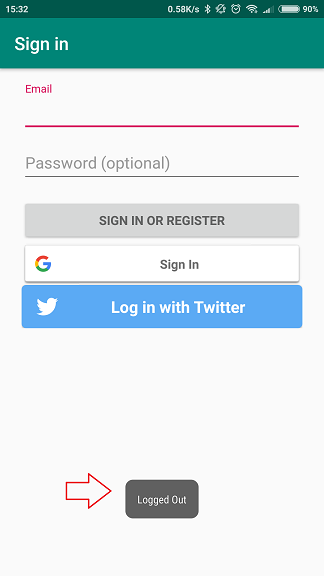
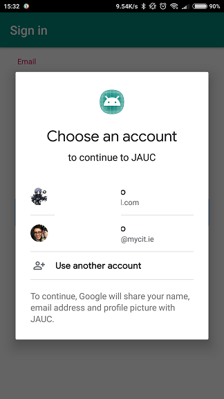
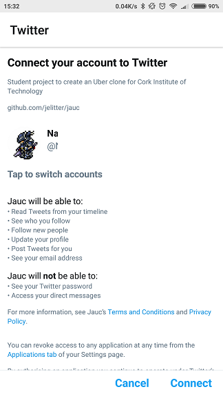
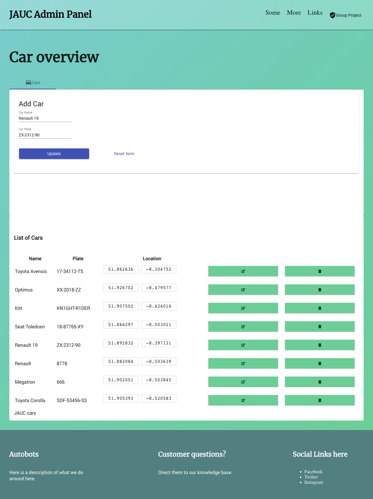

# Week 5

- Sprint deliverables (viable working product) as agreed in sprint back log

  - Mobile App is able to login and create accounts using Google and Twitter
  - Arduino board is able to track and send coordinates to the backend
  - Web App login menu is now more UX friendly and follow the agreed app styling
  - Auth Guard, Routing implemented in web app

- Any sprint documentation (sprintbacklog, user stories, designs, test etc.)

  During week 5 we worked on 12 issues worth 40 story points. 2 issues had to be moved into Week 6 sprint due to its complexity and lack of time to resolve.

  **Burndown chart**

  

  **Sprint Backlog**

  

  **Github Activity**

  

  

  **Android UI**
  Login Screen
  

  Logout Toast
  

  **Android Social Media Login**

  

  

  **Admin page styling**

  

  **Coordinates from Arduino board being stored in backend database**

  

- Sprint retrospective/review documentation.

  - We didn't have a weekly meeting this week and we noticed that this affected communication as we did work in duplicated features.
