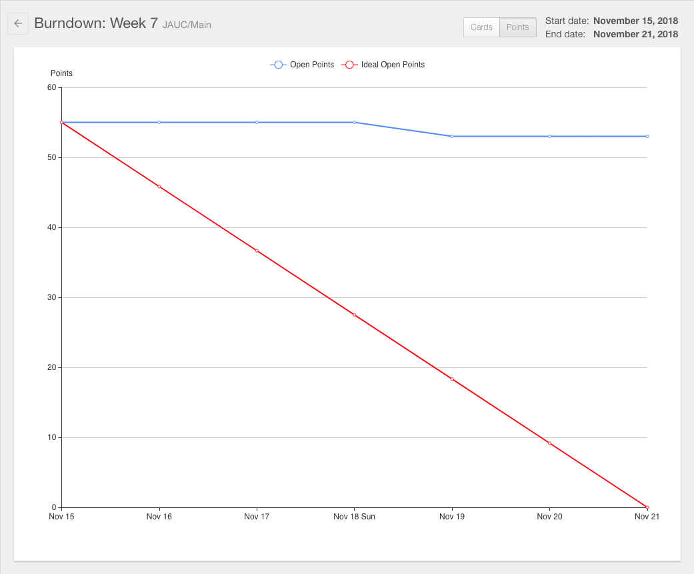
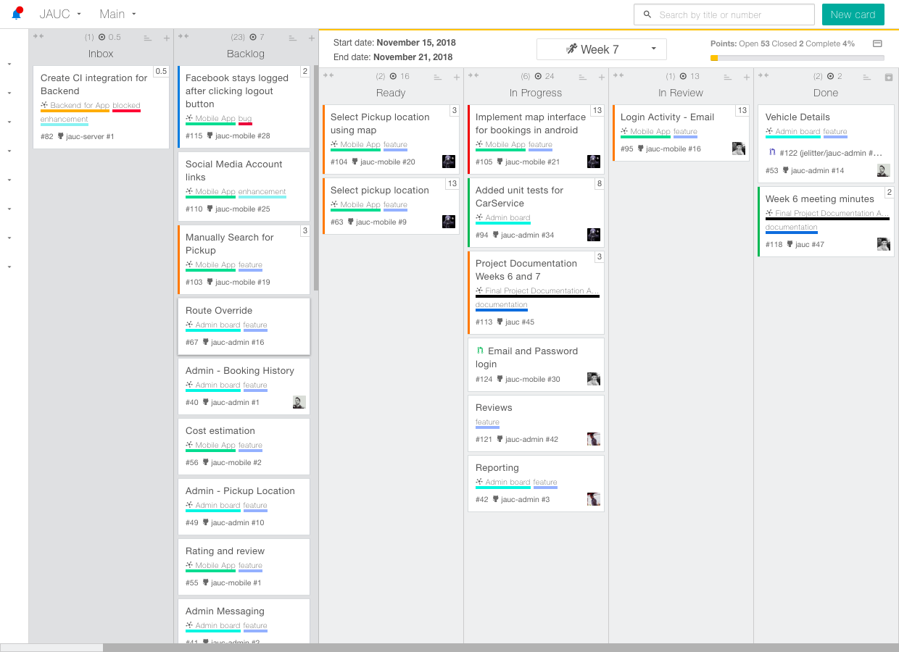
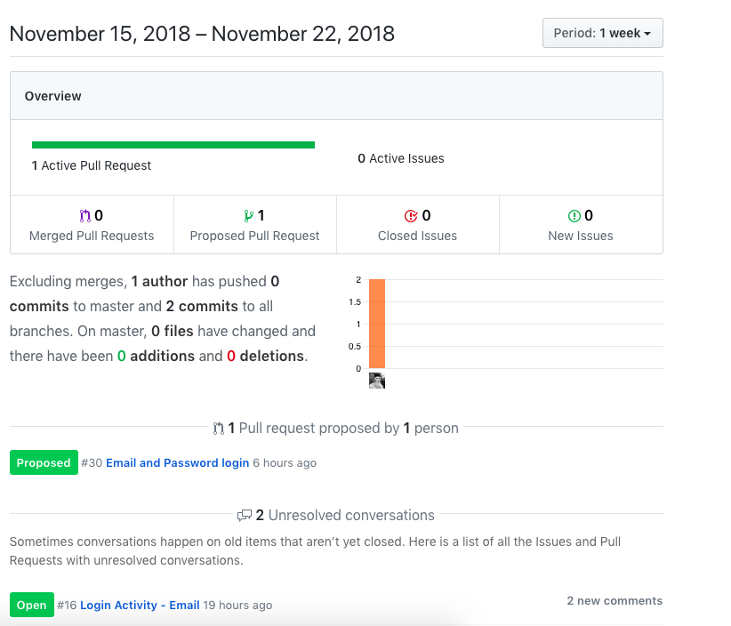
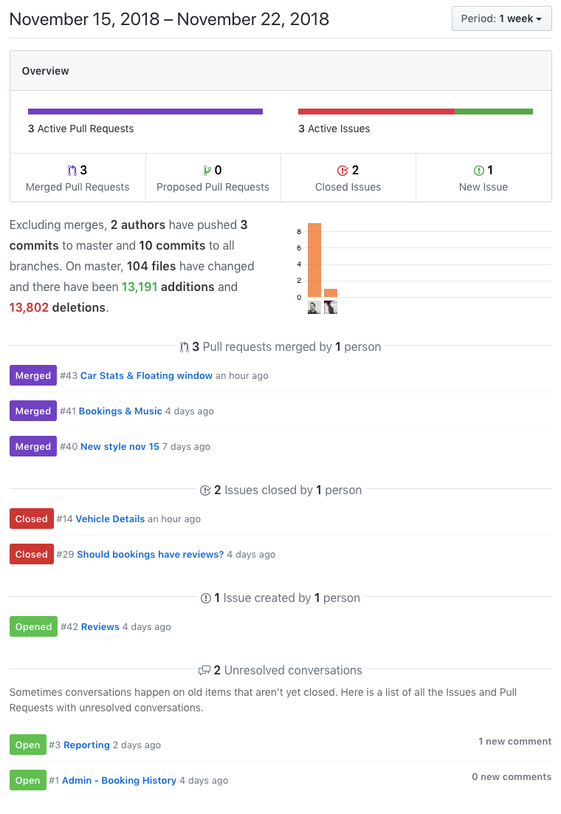
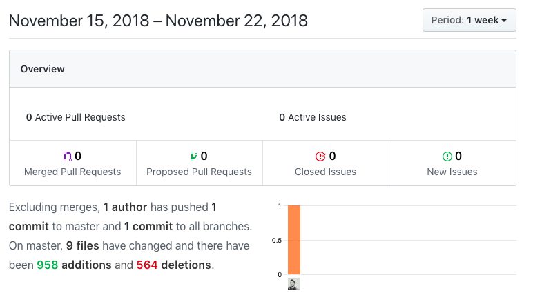
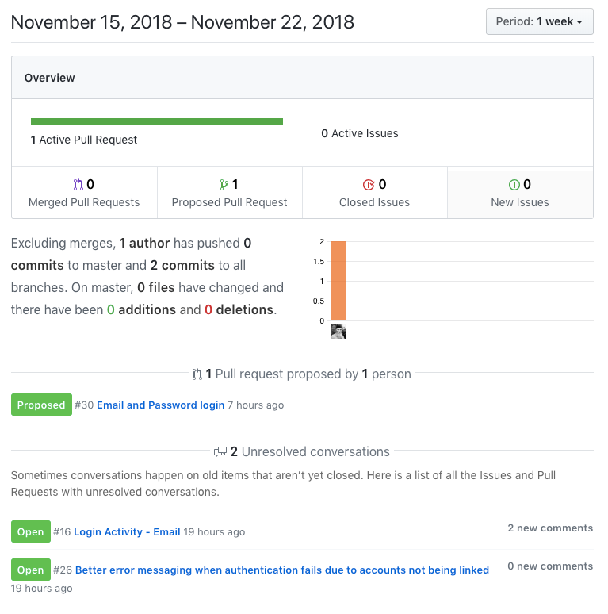

# Week 7

## Sprint deliverables (viable working product) as agreed in sprint back log

*Android end-user app*
- Splash screen
- hardned login code
- investigated map integration
- tweaking interface

*Admin interface*
- simplified interface in favour of Material design guidelines
- basic dashboard layout page added
- started with review models, advancing implementations and retraints
- decided on graph-ui framework KendoUI

*Middleware*
- Started implementation of database middleware
- includes REST API gateway to do CRUD operations on the live database

### Burndown chart

### Sprint Backlog

### Github Activity

## Sprint retrospective/review documentation

Given the added work load of other assignments, progress hasn't been as fast as during the initial start-up weeks.
However, based on an continuous effort from all parts of the team, we were able to progress on major interface issues such as admin dashboards and end-user interfaces for the Android app.