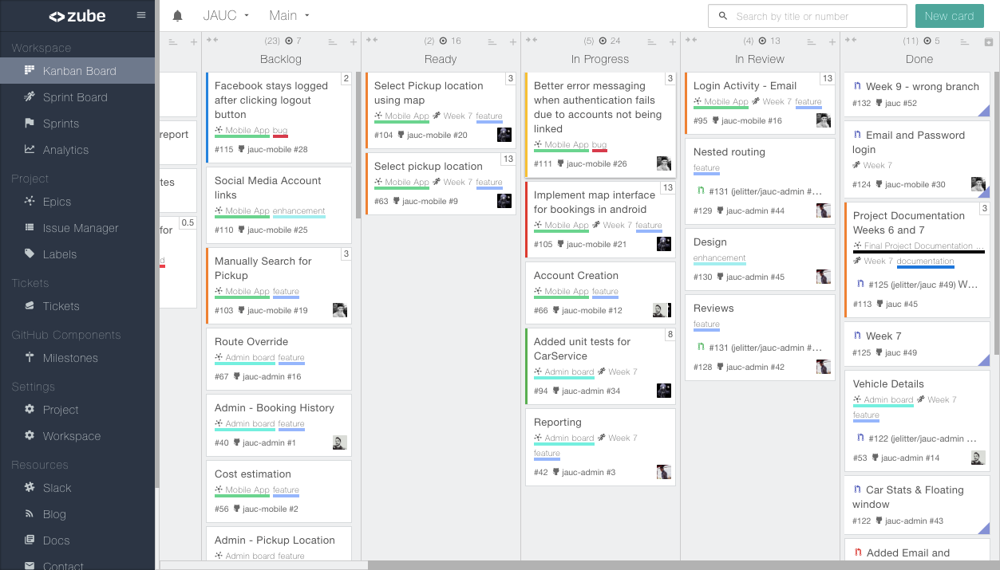
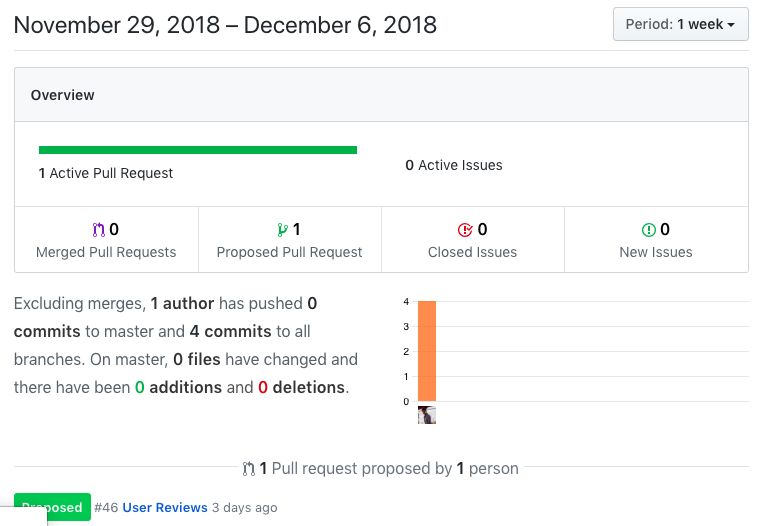
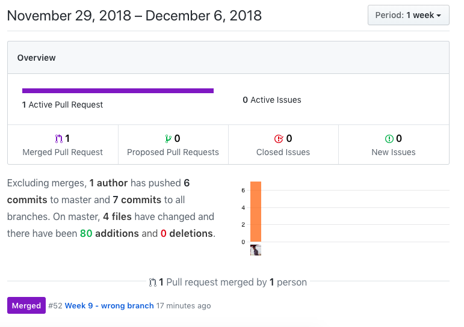
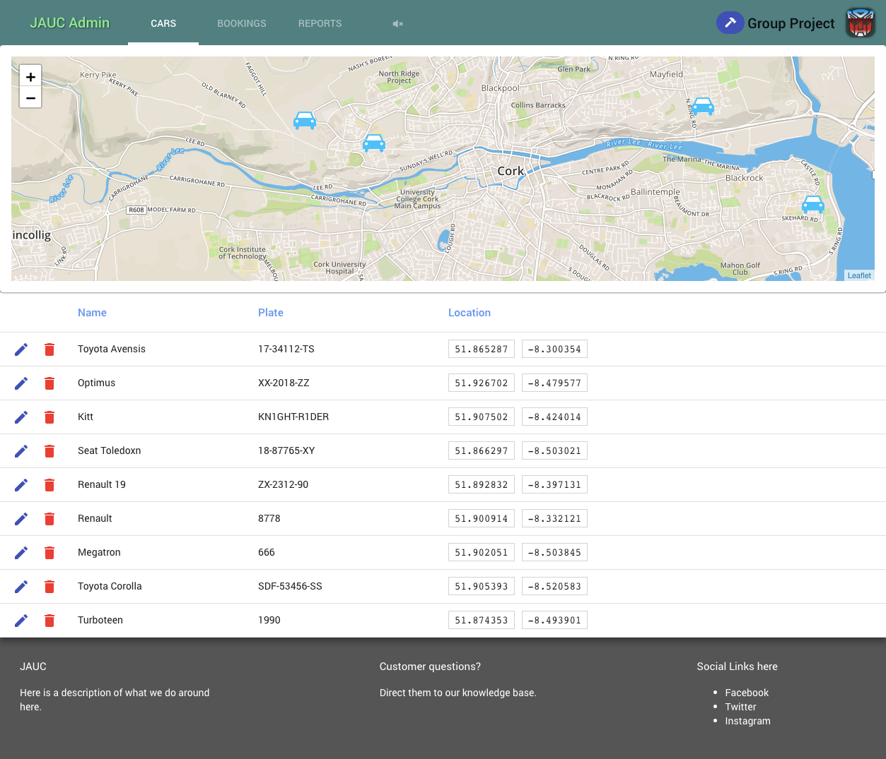
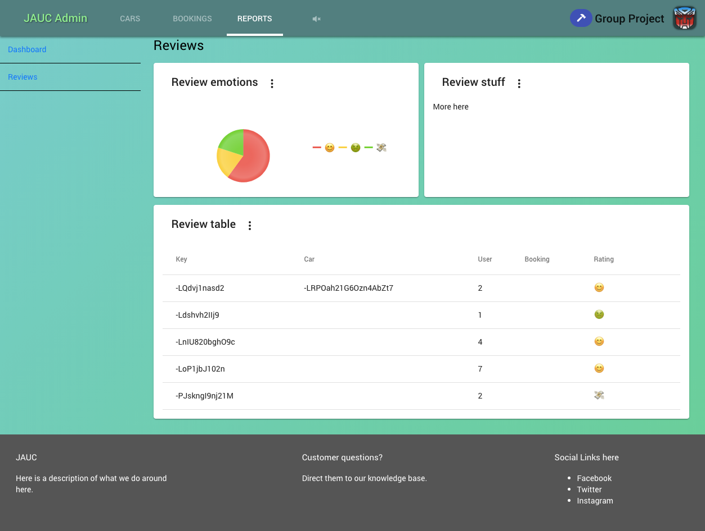

# Week 9

## Sprint deliverables (viable working product) as agreed in sprint back log

*Android end-user app*
- Splash screen
- hardned login code
- investigated map integration
- tweaking interface

*Admin interface*
-[x] simplified interface in favour of Material design guidelines
-[x] basic dashboard layout page added
-[x] started with review models, advancing implementations and retraints
-[x] decided on graph-ui framework KendoUI
-[x] realtime booking overview

*Middleware*
-[x] Started implementation of database middleware
- includes REST API gateway to do CRUD operations on the live database

### Sprint Backlog

### Github Activity

### Screenshots

## Sprint retrospective/review documentation

The past two weeks have been very slow; mainly bound by other commitments, progress was minimal.
There was some refactoring work done as well as middle-ware created to manage mobile app requests.

As a team we decided to clear all outside assignments first as their deadline is closer and frees up mind capacity for us to focus work purely on the project for the last month.
