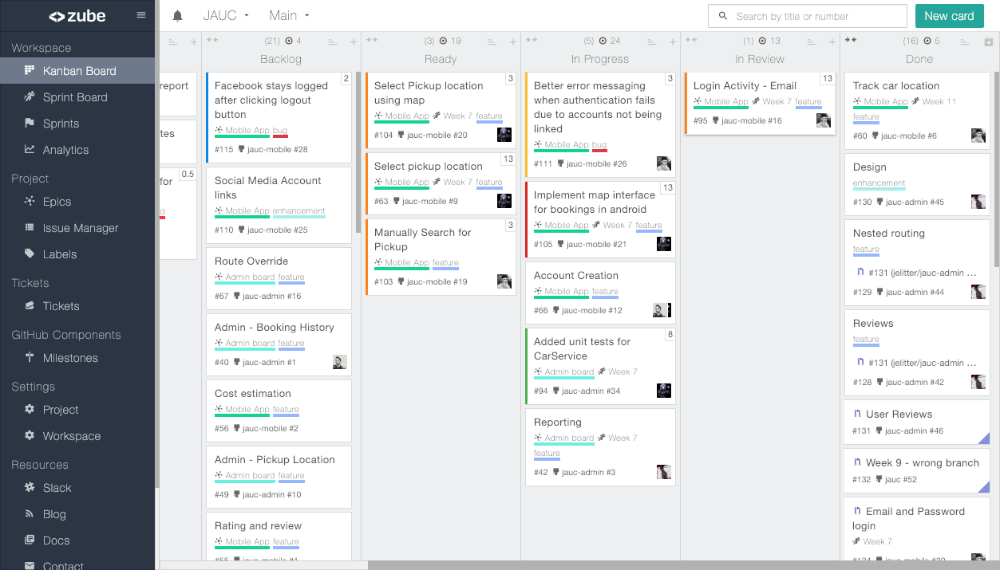
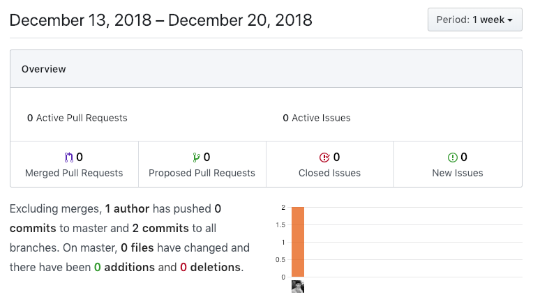
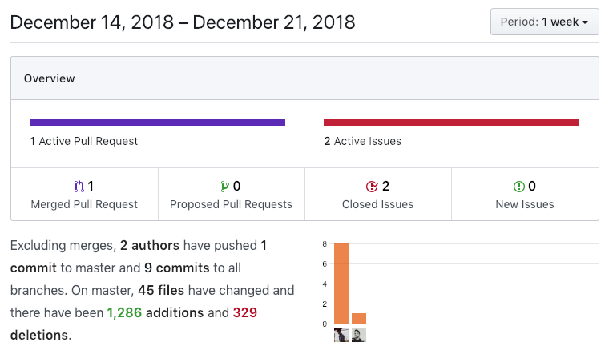
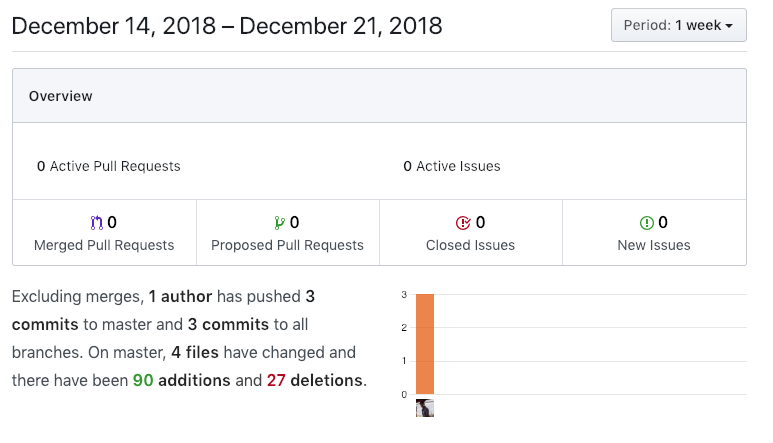

# Week 11

## Sprint deliverables (viable working product) as agreed in sprint back log

*Android end-user app*
- Splash screen
- simplified
- map integration
- car location updating in-app

*Admin interface*
- solve merge conflicts across branches
- arrange page components
- Admin dashboards

*Middleware*
- Battle-test API
- limit CRUD API surface

*Presentation*
- Clarify presentation context
- Create presentation framework

### Burndown chart

### Sprint Backlog

### Github Activity

### Screenshots

## Sprint retrospective/review documentation

After stressful semester-end exams, the team was able to come together and re-prioritise the tasks at hand.
What was supposed to be "not that hard", hasn't much increased in difficulty but with the remaining time - especially around the Christmas season - it will be paramount to focus in critical portions of the application stack.
With plenty of distractions around, three major goals are set for the time until new year:
 - Mobile app implementation
 - Middleware
 - Presentation
We are aware that a full implementation over the next 2 weeks to the presentation date is unlikely, however we will push ourselves to deliver a sensible prototype that actually works.
